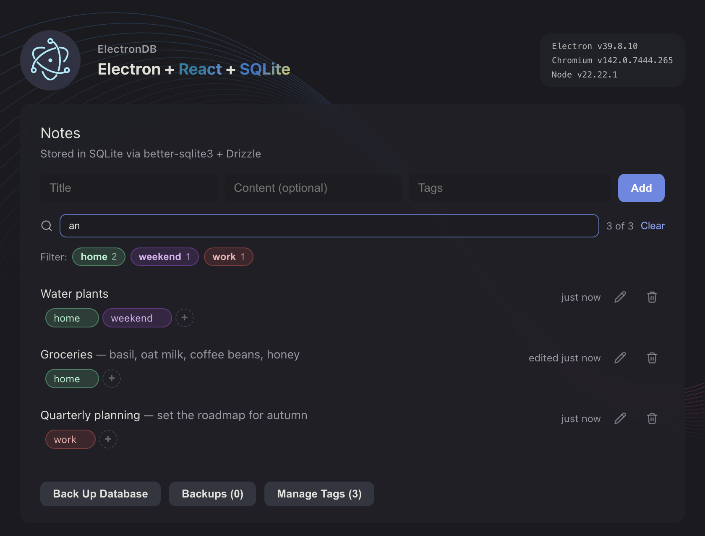
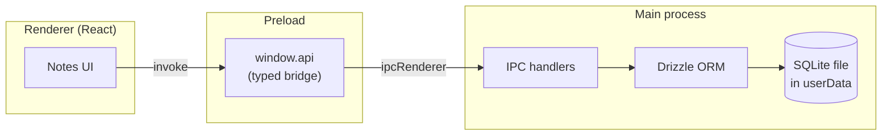
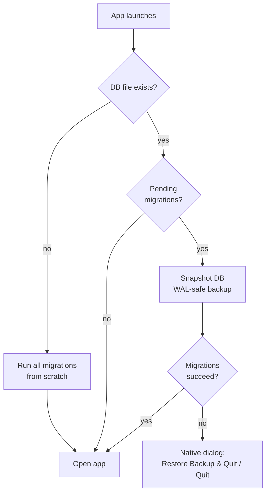

# electron-db

**A cross-platform Electron starter with a real embedded database — and the upgrade story most starters skip.**

[](https://github.com/arjunemirchandani/electron-db/actions/workflows/ci.yml)
[](LICENSE)


Most Electron + SQLite examples stop at "open a database and run a query." The hard part of shipping a desktop app with local data is everything that happens *after* v1.0: schema changes arriving via app updates, migrations failing on a user's machine you can't see, and data you must never lose. This repo is a working foundation for that whole lifecycle — schema migrations that run themselves, automatic backups before every upgrade, a restore path when things go wrong, and an end-to-end test suite that proves all of it by driving the real app on macOS, Windows, and Linux in CI.

<p align="center">
  
</p>

## What's inside

- ⚡ **Electron + React 19 + TypeScript** on [electron-vite](https://electron-vite.org/) — instant HMR, clean main/preload/renderer split
- 🗄️ **SQLite via [better-sqlite3](https://github.com/WiseLibs/better-sqlite3)** — fast, synchronous, in-process; native module rebuild handled automatically
- 🧭 **[Drizzle ORM](https://orm.drizzle.team/)** — typed schema, typed queries, and generated SQL migrations
- 🔁 **Self-upgrading database** — pending migrations are detected and applied on launch; new installs and version upgrades need zero user action
- 🛟 **Backups you didn't have to remember** — a WAL-safe snapshot is taken automatically before any migration runs (plus a manual *Back Up Database* button), pruned to the 3 most recent; an in-app **Backups** panel lists them and restores any one with a click (taking a safety snapshot first, so a restore is itself reversible)
- 🚨 **Graceful failure** — if a migration fails, users get a native *Restore Backup & Quit* dialog instead of a broken white screen
- 🏷️ **Tags done properly** — a many-to-many `tags`/`note_tags` model (the repo's first shipped migration) with color-coded chips, chip-style input with autocomplete, multi-select all/any filtering, and a Manage Tags panel for colors, rename, merge, and delete
- 🔒 **Typed IPC contract** — the renderer never touches the database; it calls a `window.api` bridge whose types are shared between main and renderer, so drift is a compile error
- ✅ **Playwright e2e suite** — tests launch the built app, click the actual UI, and assert on real files and real SQLite databases; green on a three-OS CI matrix
- 🤖 **AI-agent ready** — a committed [driver skill](.claude/skills/run-electrondb/SKILL.md) lets Claude Code (and similar agents) launch, drive, and screenshot the app safely in a sandboxed profile

## Quick start

```bash
git clone https://github.com/arjunemirchandani/electron-db.git
cd electron-db
npm install     # also rebuilds better-sqlite3 against Electron's ABI
npm run dev     # launches the app with HMR
```

The database is created on first launch at the platform's per-user data directory:

| Platform | Location |
|---|---|
| macOS | `~/Library/Application Support/electrondb/electrondb.sqlite3` |
| Windows | `%APPDATA%/electrondb/electrondb.sqlite3` |
| Linux | `~/.config/electrondb/electrondb.sqlite3` |

## How it works



The renderer is fully sandboxed from Node and the filesystem. Every database operation flows through one typed contract ([`src/shared/types.ts`](src/shared/types.ts)) — add a method there and the compiler walks you through wiring it in the preload bridge, the IPC handler, and the UI.

### The upgrade lifecycle



Every schema change ships as an immutable, numbered SQL file in [`drizzle/`](drizzle/). On startup, the app compares that journal against a ledger table inside the user's database and applies only what's missing — so a user jumping from v1.0 to v1.4 replays three migrations in order, while a fresh install runs them all. App version numbers never matter; the database knows its own state.

### Changing the schema

```bash
# 1. Edit src/main/db/schema.ts
# 2. Generate the migration
npx drizzle-kit generate
# 3. Review the SQL in drizzle/, commit it — done.
```

Migrations run automatically on next launch. Two rules keep upgrades safe: **never edit a migration that has shipped** (ship a new one instead), and hand-add any data backfill (`UPDATE ...`) to the generated file *before* it ships.

## Testing

```bash
npm run test:e2e
```

No mocks: the suite builds the app, launches the real binary against a throwaway data directory per test, and drives the actual UI with Playwright. It covers CRUD and persistence across relaunch, fresh-install initialization, the backup-before-migration flow (including idempotence and pruning), and both migration-failure paths — verifying restored databases down to `PRAGMA integrity_check` and WAL cleanup. A few environment hooks (`ELECTRONDB_USER_DATA`, `ELECTRONDB_MIGRATIONS_DIR`, `ELECTRONDB_MIGRATION_CHOICE`) make the failure dialogs and upgrade scenarios scriptable; they're documented in [the driver skill](.claude/skills/run-electrondb/SKILL.md).

CI runs the whole suite on `macos-latest`, `windows-latest`, and `ubuntu-latest` on every push — which continuously proves the part of this stack people worry about most: the native module working on all three platforms.

## Project structure

```
src/
  main/
    db/schema.ts    # Drizzle schema — single source of truth
    db/index.ts     # init, migrations, backup/restore
    ipc.ts          # IPC handlers (the only DB gateway)
    index.ts        # app lifecycle, migration-failure dialog
  preload/          # typed window.api bridge
  renderer/         # React UI
  shared/types.ts   # the IPC contract both sides compile against
drizzle/            # generated SQL migrations (append-only, shipped with the app)
e2e/                # Playwright suite + fixtures
.claude/skills/     # agent driver for AI-assisted development
```

## Building installers

```bash
npm run build:mac     # .dmg
npm run build:win     # NSIS installer
npm run build:linux   # AppImage, deb
```

electron-builder handles code paths for the packaged app (the `drizzle/` folder ships via `extraResources`; the native module is unpacked automatically).

## Releases & auto-update

Pushing a version tag (`git tag v1.1.0 && git push origin v1.1.0`) builds installers on all three platforms and publishes them to a [GitHub Release](https://github.com/arjunemirchandani/electron-db/releases). Installed apps then pick updates up automatically:

- **Windows & Linux (AppImage)** — full auto-update via electron-updater: downloaded in the background, applied on a "Restart Now" prompt. After an update, any new schema migrations run on next launch — with the automatic backup taken first.
- **macOS** — this template ships **unsigned by design** (a foundation repo shouldn't carry a publisher's signing identity), and macOS refuses to auto-update unsigned apps. Instead the app checks GitHub for a newer release and offers the download page. A downstream app that adds its own certificate can delete that branch in [`src/main/updater.ts`](src/main/updater.ts) and use electron-updater everywhere.

> **Downloading the macOS build?** Because the app is unsigned and un-notarized, Gatekeeper quarantines internet downloads and shows a misleading *"electrondb.app is damaged and can't be opened"* dialog. The app is fine — clear the quarantine attribute and it launches normally:
>
> ```bash
> xattr -cr /Applications/electrondb.app
> ```
>
> Or skip the issue entirely by building from source (`npm run build:mac`) — locally built apps are never quarantined. Signed downstream apps don't have this friction.

## License

[MIT](LICENSE) © Arjune Mirchandani
